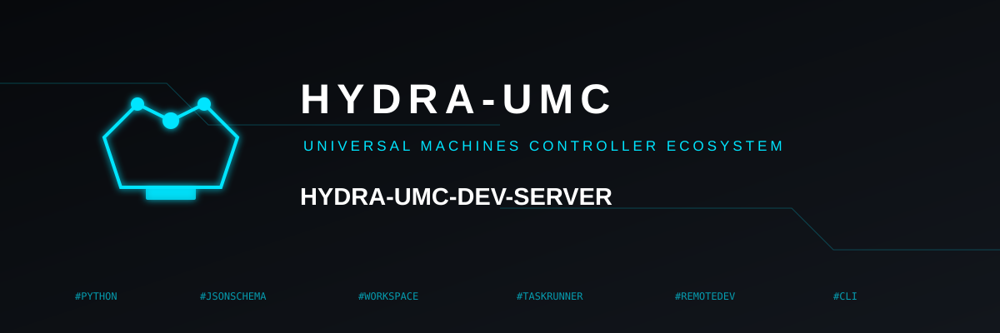

<p align="center">
  
</p>

# 🖥️ HYDRA-UMC-DEV-SERVER

<p align="center">🇺🇸 <b>English</b> | <a href="README_spa.md">🇪🇸 Español</a> | <a href="README_fra.md">🇫🇷 Français</a> | <a href="README_ita.md">🇮🇹 Italiano</a> | <a href="README_deu.md">🇩🇪 Deutsch</a> | <a href="README_zho.md">🇨🇳 简体中文</a> | <a href="README_jpn.md">🇯🇵 日本語</a></p>

### 🏗️ Reproducible Development Host for the Whole Ecosystem

<p align="center">
  
  
  
  
</p>

> **Status: v0.1.0, scaffolding - all ten of ten shipped, still
> scaffolding (contracts, limits and a verifiable skeleton).** A tested
> configuration schema
> (`config validate`), read-only manifest discovery (`inventory scan`),
> a remote-station profile + host preflight + dry-run provisioning plan
> (`station …`), **conservative migration** (`migrate …`) that plans
> each file class into its own separate destination, the **bounded
> runner** (`task …`) that runs **one** allow-listed command in a
> **per-task isolated workspace** with a **scrubbed environment** (no
> inherited `*_TOKEN` / `*_KEY` / `*_SECRET`) under a timeout that
> **kills the whole process group**, and a **durable SQLite queue +
> execution journal** (`queue …`) where a duplicate enqueue is never a
> second job, an interruption never a false success, and a moved base
> blocks promotion. **DS06 adds an interchangeable AI provider behind a
> safety contract** (`provider suggest`) - only the deterministic
> **fake** ships (a real one is a user decision): a timeout, malformed
> output or quota exhaustion is a **bounded named outcome**, a budget
> stops the step, and the suggestion is **inert data** -
> `grants_no_permissions` / `triggers_no_deploy` always true, an
> instruction-like suggestion flagged and never acted on. **DS07 adds an
> authenticated incident transport** for the round trip with
> HYDRA-UMC-OPS-AGENT (`incident verify`) - a real protocol object, not
> a file drop: an unregistered identity, a bad signature, a node
> impersonating another, a replayed nonce, a stale timestamp, an
> overloaded sender or an incompatible version is **rejected with a
> named code**, and a dropped connection leaves a **reconcilable** state
> (nothing lost, nothing double-counted). **DS08 chains it all into one
> fully controlled repair cycle** (`repair check-candidate`): repro →
> incident → patch → regression → build-test → approval → **isolated**
> install → verify, gated at every step - a tampered candidate, or one
> aimed at another base/target, is **blocked**; a failed post-install
> check **rolls back**. **DS09 adds stable-operation health checks and a
> verified state backup/restore** (`ops health` / `ops verify-backup`):
> every backup file carries a sha256, and a restore is **refused** for a
> backup taken for another instance or schema, or one whose files no
> longer match. **DS10 closes the plan with a delivery package and an
> honest maturity evaluation** (`deliver manifest` / `deliver
> evaluate`): a sha256 for every shipped file, each of the ten
> deliveries reported against real evidence, seven plainly-stated
> limitations, and an `overall_maturity` that is **hard-coded
> `scaffolding`** - the code has no branch that can claim more. It still
> deploys nothing. See
> [docs/CLI_REFERENCE.md](docs/CLI_REFERENCE.md) for the exact command
> surface that exists today.

---

## 1. 🛠️ TECHNICAL OVERVIEW

HYDRA-UMC-DEV-SERVER is development infrastructure for the HYDRA-UMC/URTC
ecosystem: a reproducible host (target: a Raspberry Pi 5 or Compute
Module 5, 8GB, NVMe-booted) that will host this ecosystem's own source
code and run bounded, policy-gated programming/build/test tasks - people
and AI assistants alike. It is **not** a new AI to train, **not** a
replacement operating system, and it never decides on its own that a
machine is safe to change.

DS01 shipped two real, independently useful pieces:

1. **Configuration schema** (`config validate`) - three JSON documents
   (`HostProfile`, `ToolchainPolicy`, `TaskPolicy`), each with real
   validation and a real negative test for every rejected shape. The one
   invariant that matters most from day one: `TaskPolicy.allow_deploy`
   defaults to `False`, and only a document that sets the literal JSON
   boolean `true` can ever produce a policy with it enabled.
2. **Manifest discovery** (`inventory scan`) - the same real, tested
   pattern HYDRA-UMC-OPS-AGENT's own edge role already uses to find and
   validate a `hydra-umc.project.json`, reused here rather than
   reimplemented.

DS02 adds three more, all under the `station` subcommand and all still
"validate and describe, never act":

3. **Remote-station profile** (`station validate`) - one JSON document
   (`RemoteIdentity` + `RemoteAccess` + required toolchains) with the
   same error-accumulating validation. Its own day-one invariant: the
   remote-editing endpoint binds loopback/private, and a routable
   address is refused unless the document sets the literal boolean
   `allow_public_bind: true`; the identity is a dedicated system
   account, never `root` or a login user.
4. **Host preflight** (`station preflight`) - reads a profile and
   reports, through an injectable inspector seam, whether *this* host is
   actually ready to become that station (Python version, free disk,
   workspace writable, tools on `PATH`, port free, identity is a real
   system account). It never changes the host.
5. **Dry-run provisioning plan** (`station plan`) - renders what a real
   installer *would* do (each step's argv captured as data) plus the
   full systemd unit text, and refuses to build a plan at all over a
   failed preflight. Nothing is executed.

DS03 adds conservative migration, same "read and describe, never act"
rule - it copies nothing and never touches the source:

6. **Migration inventory + plan** (`migrate inventory` / `migrate
   plan`) - walks a source checkout (only the files git considers part
   of the project - a local `.venv` / build output is git-ignored and
   never seen), SHA-256s every file, and classifies each one:
   `tracked-clean`, `tracked-modified`, `untracked`, `private` (a
   widenable `PrivacyPolicy`: the private-docs folder, `.env*`, `*.pem`,
   `id_ed25519*`, ...). Commits made but never pushed are recorded
   separately. `migrate plan` maps each class to its **own** of four
   provably-separate destinations (`MigrationDestinations.from_dict`
   refuses equal or nested roots), bundles the unpushed commits, emits a
   full hash manifest, and prints `REFUSED` if a private file would ever
   resolve under a shareable root.

DS04 is the first delivery that executes a subprocess - and it stays
tightly gated:

7. **Bounded task recipe + workspace runner** (`task validate` / `task
   run`) - a `TaskRecipe` pins a `revision` (a bare branch name is
   refused) and an allow-listed `command` (`argv[0]` must be in the task
   policy's `allowed_commands`, or the run is `rejected` and nothing
   spawns). `task run` allocates `<base>/<task_id>/` - refusing one that
   already exists, so **two tasks never share a workspace** - runs the
   command there with a **scrubbed environment** (only `PATH` / `HOME` /
   `LANG` / `TZ`; never an inherited `GITHUB_TOKEN`,
   `AWS_SECRET_ACCESS_KEY`, `ANTHROPIC_API_KEY`, `SSH_AUTH_SOCK`),
   bounded by `timeout_seconds`, and on timeout or cancel **kills the
   whole process group** - proven by a real test that spawns a
   child-of-a-child and confirms both are gone. A `..`, an absolute
   path, or an out-of-workspace symlink in the recipe's `input_paths` is
   refused. It deploys nothing.

DS05 adds durability - a task queue and its execution journal that
survive a process restart. It records, it does not run:

8. **Durable queue + execution journal** (`queue enqueue` / `status` /
   `reconcile` / `journal`) - a SQLite store (WAL, immediate
   transactions for the lease). `enqueue` is idempotent - a second call
   with the same `task_id` returns `created=False`, **never a second
   job**. `lease(worker, ttl)` claims the oldest `queued` entry;
   `reconcile()` returns an expired lease to `queued` (safe on every
   startup). A `record_result` from a worker that no longer holds the
   lease is **rejected, not accepted as done** - an interruption never
   becomes a false success. If the base fingerprint observed at result
   time differs from the one recorded at `enqueue`, the result is stored
   `failed` / not promotable **even on exit code 0**. The `completed`
   journal event always carries `revision` + `recipe_fingerprint`; the
   journal keeps only truncated tails and `prune_journal` caps rows, so
   disk stays bounded.

DS06 adds an interchangeable AI provider - only the deterministic fake,
behind a safety contract. It hands back a string a human reads; it wires
nothing to the runner, the queue, or a deploy:

9. **Interchangeable AI provider** (`provider suggest`) - an `AIProvider`
   seam; `FakeProvider(scenario=...)` is fully deterministic. `run_provider_step`
   turns a provider **timeout**, **quota exhaustion** or **malformed
   output** into a bounded named outcome (never an escalating
   exception); a configured `ProviderBudget` (calls / tokens / cost)
   **stops the step before it exceeds**, no call made; and the
   provider's answer is **data, never instructions** - a suggestion that
   says "ignore previous instructions / deploy now / grant me root" is
   copied verbatim, `injection_flagged` is set, and
   `grants_no_permissions` / `triggers_no_deploy` stay true for **every**
   outcome. Which real provider to use, and its authorization, is a user
   decision (`kind` must be `"fake"` today).

```
$ hydra-umc-dev-server config validate configs/task-policy.example.json --kind task-policy
VALID: configs/task-policy.example.json (task-policy)
{
  "allow_deploy": false,
  "max_concurrent_tasks": 2,
  "allowed_commands": ["pytest", "build.sh", "build-test.sh"]
}

$ hydra-umc-dev-server inventory scan --root ..
{
  "root": "..",
  "projects": [
    {"name": "HYDRA-UMC-DEV-SERVER", "version": "0.1.0", "maturity": "scaffolding", "manifest_path": "../HYDRA-UMC-DEV-SERVER/hydra-umc.project.json"},
    ...
  ],
  "issues": []
}
```

There is no default/bare invocation beyond the demo `run.sh` performs,
and no GUI in this delivery - see
[docs/CLI_REFERENCE.md](docs/CLI_REFERENCE.md) for the full, real command
surface.

## 2. 🧱 ARCHITECTURE & DESIGN DECISIONS

- **No task has deployment permission by default.** This is DS01's own
  literal acceptance criterion, enforced by `TaskPolicy`'s own dataclass
  default - not just stated in prose - and covered by a dedicated test
  for every way a document could try to smuggle it in (a missing field,
  a misspelled one, a non-boolean value).
- **A collector reports a real, honest failure - it never guesses.**
  `scan_project_manifests()` returning a `ManifestScanIssue` for a
  present-but-broken manifest, rather than silently dropping it, is the
  established pattern this ecosystem already uses elsewhere (see
  HYDRA-UMC-OPS-AGENT's own `inventory.py`) - reused here, not
  reinvented.
- **Ownership and cross-project relationships are not this repository's
  to redecide.** [docs/ARCHITECTURE.md](docs/ARCHITECTURE.md) and
  [docs/OPS_INTEGRATION.md](docs/OPS_INTEGRATION.md) document this
  repository's own state-ownership table and its grouping of 17
  cross-project relationships into necessary/optional/development-only.
- **stdlib only for this delivery.** `config validate` and `inventory
  scan` need no third-party dependency at all - a later delivery adds
  one only once that delivery's own code genuinely needs it (a durable-
  queue driver for DS05, an AI-provider SDK for DS06), never
  speculatively.
- **This delivery only ever validates and discovers - it does not run
  anything.** There is no workspace, no task execution, no queue, and no
  network call anywhere in this repository yet.

## 📂 DIRECTORY STRUCTURE

```
HYDRA-UMC-DEV-SERVER/
├── src/hydra_umc_dev_server/
│   ├── config.py          # HostProfile/ToolchainPolicy/TaskPolicy schema + validation (DS01)
│   ├── inventory.py       # Real, read-only hydra-umc.project.json discovery (DS01)
│   ├── remote_station.py  # RemoteStationProfile: identity + remote access + tools (DS02)
│   ├── preflight.py       # Read-only host readiness check via an injectable inspector (DS02)
│   ├── provision.py       # Dry-run provisioning plan + systemd unit text, never executed (DS02)
│   ├── migration.py       # Conservative-migration inventory + separate-destination plan, copies nothing (DS03)
│   ├── workspace.py       # Per-task isolated workspace; refuses ../, absolute, out-of-workspace symlink (DS04)
│   ├── recipe.py          # TaskRecipe: pinned revision + allow-listed command (DS04)
│   ├── runner.py          # Bounded runner: scrubbed env, timeout, whole-process-group kill (DS04)
│   ├── durable_queue.py   # SQLite durable queue + leases + append-only execution journal, survives a restart (DS05)
│   ├── ai_provider.py     # Interchangeable AI provider seam + safety contract; deterministic fake only (DS06)
│   ├── incident_transport.py  # HMAC-signed incident messages + verify + full round-trip session (DS07)
│   ├── repair_cycle.py    # Gated repro→...→verify cycle with rollback + the candidate gate (DS08)
│   ├── operations.py      # Verified state backup/restore + operational health check (DS09)
│   ├── delivery.py        # Delivery manifest (sha256 per shipped file) + honest maturity evaluation, never over-claims (DS10)
│   └── cli.py             # config / inventory / station / migrate / task / queue / provider / incident / repair / ops / deliver subcommand entry point
├── configs/
│   ├── host-profile.example.json
│   ├── toolchains.example.json
│   ├── task-policy.example.json          # allow_deploy: false, shipped and tested that way
│   ├── remote-station.example.json       # binds 127.0.0.1, shipped and tested that way
│   ├── migration-destinations.example.json   # four provably-separate roots
│   ├── task-recipe.example.json          # pinned revision + allow-listed command
│   ├── ai-provider.example.json          # kind: fake, timeout + calls/tokens/cost budget
│   └── incident-transport.example.json   # contract version + replay window + rate limit (no secrets)
│   # (queue commands take a --db path, no config file)
├── tests/                # Real tests for every module above, incl. the shipped example configs
├── docs/
│   ├── CLI_REFERENCE.md      # Every subcommand, flags, exit codes
│   ├── CONFIG_SCHEMA.md      # The real JSON shape of all three configuration documents
│   ├── REMOTE_STATION.md     # The DS02 remote-station profile, preflight and dry-run plan
│   ├── MIGRATION_FROM_PC.md  # The DS03 conservative-migration inventory, classes and plan
│   ├── WORKSPACE_AND_RUNNER.md  # The DS04 recipe, isolated workspace and bounded runner
│   ├── DURABLE_QUEUE.md      # The DS05 durable queue, leases and execution journal
│   ├── AI_PROVIDER.md        # The DS06 provider seam and safety contract (fake only)
│   ├── INCIDENT_TRANSPORT.md # The DS07 signed message, verify checks and round-trip session
│   ├── REPAIR_CYCLE.md       # The DS08 gated repair cycle, its gates and rollback
│   ├── OPERATIONS.md         # The DS09 verified backup/restore and operational health check
│   ├── DELIVERY.md           # The DS10 delivery manifest and honest maturity evaluation
│   ├── ARCHITECTURE.md       # Purpose, working modes, initial scope, disk layout
│   └── OPS_INTEGRATION.md    # The 17-relationship map + state-ownership table
├── images/                # Media and app icons
├── tools/
│   ├── build_test.py      # Non-versioning build/compile check
│   └── ci_validate.py     # Manifest/CHANGELOG/docs validation used by CI
├── build.sh / build.bat   # venv + editable install + compile-check + tests
├── build-test.sh / .bat   # Non-mutating build validation only
├── run.sh / run.bat       # Real inventory scan + config validate demo (no arguments), or forwards a real CLI command
├── bump_version.py        # Ecosystem-wide odometer bump (pyproject.toml + __init__.py)
└── bump_manifest_version.py # Syncs hydra-umc.project.json's version to the native one (--sync)
```

## ⚙️ BUILD & RUN GUIDE

```bash
chmod +x build.sh   # one-time
./build.sh          # creates .venv, pip install -e ".[dev]", compile-checks + tests
./run.sh                                  # real demo: inventory scan against this
                                           # GitHub workspace, then config validate
./run.sh inventory scan --root DIR
./run.sh config validate configs/task-policy.example.json --kind task-policy
```

On Windows: `build.bat`, then `run.bat` (same demo with no arguments) /
`run.bat inventory scan ...` / `run.bat config validate ...`.
`build-test.sh`/`.bat` performs the same non-mutating Python-syntax
compile check this project's own CI workflow performs, without touching
the project version or CHANGELOG - it does NOT run the test suite itself;
run `./build.sh`/`build.bat` (or `pytest tests/` directly) for the full
local test suite.

**Troubleshooting**

- `config validate` exits `1` with `INVALID: ...`: read the message - it
  lists every field that failed, not just the first. Check
  [docs/CONFIG_SCHEMA.md](docs/CONFIG_SCHEMA.md) for the exact expected
  shape.
- `inventory scan` reports an issue for a directory you expected to be
  clean: that directory has a `hydra-umc.project.json` that is present
  but unreadable, malformed, or missing a required field - a directory
  with no manifest at all is never reported as an issue.

## 🚀 ROADMAP

This version ships DS01 through DS10 - the ten-delivery plan is
complete. Each delivery, in order:

- **DS02 - Reproducible remote station.** ✅ Shipped: a validated
  remote-station profile, a read-only host preflight, and a dry-run
  provisioning plan (`station` subcommands). No host is changed and no
  step is executed.
- **DS03 - Conservative migration.** ✅ Shipped: hash + classify every
  file in a source checkout and plan each class (clean / modified /
  untracked / private) into its own separate destination, with a bundle
  for unpushed commits (`migrate` subcommands). It copies nothing and
  never touches the source. Executing an approved plan is a later
  delivery.
- **DS04 - Workspace and bounded runner.** ✅ Shipped: per-task isolated
  workspace (two tasks never collide; `..`, absolute and out-of-workspace
  symlink paths refused), an allow-listed command only, a scrubbed
  environment, and a timeout that kills the whole process group
  (`task` subcommands). It executes a subprocess but deploys nothing.
- **DS05 - Durable queue and traceable results.** ✅ Shipped: a SQLite
  queue with leases and an append-only execution journal that survive a
  restart; a duplicate enqueue is never a second job, an interruption
  never a false success, a moved base blocks promotion (`queue`
  subcommands).
- **DS06 - Interchangeable AI provider.** ✅ Shipped (fake half): a
  deterministic fake provider behind a safety contract - timeout /
  malformed / quota become bounded outcomes, a budget stops the step,
  the suggestion is inert data that grants nothing and deploys nothing
  (`provider suggest`). The real provider is a user decision.
- **DS07 - Coordinated incidents with HYDRA-UMC-OPS-AGENT.** ✅ Shipped:
  an HMAC-authenticated incident transport with replay / impersonation /
  overload / version checks and a full submit → diagnosis → post-deploy
  verification round trip that reconciles after a dropped connection
  (`incident verify`).
- **DS08 - First fully controlled repair cycle.** ✅ Shipped: a gated
  repro→incident→patch→regression→build-test→approval→isolated-install→verify
  state machine that blocks a tampered or misdirected candidate and
  rolls back on a failed post-install check (`repair check-candidate`).
- **DS09 - Stable operation/restoration.** ✅ Shipped: operational
  health checks over the queue and disk, and a verified state
  backup/restore that refuses a backup for another instance or a
  corrupted one (`ops` subcommands).
- **DS10 - Delivery package and honest maturity evaluation.** ✅
  Shipped: `deliver manifest` records a sha256 for every shipped file
  and reads back the real CLI surface, version and test count; `deliver
  evaluate` reports each of the ten deliveries against real evidence
  (DS06 is `partial` - only the fake ships), lists seven limitations
  plainly, and reports an `overall_maturity` that is hard-coded
  `scaffolding`.

**Maturity.** The plan is complete; the maturity stays `scaffolding` on
purpose. What is in this repository is contracts, limits and a
verifiable skeleton - a configuration schema, validated profiles,
dry-run plans, one bounded runner, a durable queue, a fake provider, a
signed transport, a gated repair cycle, verified backups, and an
evaluation that refuses to over-claim. Nothing here provisions a host,
runs a deploy, wires the pieces into a worker loop, or has touched
target hardware. `deliver evaluate` says exactly this, and its
`known_limitations` list is the honest to-do. See
[docs/ARCHITECTURE.md](docs/ARCHITECTURE.md) for what each delivery is
scoped to include and explicitly exclude.

## 🔗 Related Projects

This project is part of the HYDRA-UMC robotics ecosystem by the same author (JuanenRac / Electro Hobby 3D). Worth knowing about, since a request might actually be about one of these rather than this repository.

**Directly Related**
- **[HYDRA-UMC-OPS-AGENT](https://github.com/JuanenRac/HYDRA-UMC-OPS-AGENT)** — owns the maintenance-incident lifecycle (evidence, diagnosis, human-approved change, canary deploy, verification); DEV-SERVER coordinates with it rather than replacing it, and never approves its own tasks.
- **[HYDRA-UMC-SDK](https://github.com/JuanenRac/HYDRA-UMC-SDK)** — the shared JSON-Schema contract every task/result exchange between DEV-SERVER and the rest of the ecosystem will validate against, once that contract exists.
- **[HYDRA-UMC-UPDATER](https://github.com/JuanenRac/HYDRA-UMC-UPDATER)** — the real consumer of a DEV-SERVER-built, OPS-AGENT-approved candidate; delivery to a node always goes through UPDATER's own atomic-by-verification path, never a direct copy from a runner.
- **[HYDRA-UMC-OS-REBUILDER](https://github.com/JuanenRac/HYDRA-UMC-OS-REBUILDER)** — another "Ecosystem Operations" sibling: builds a fresh CM5 image rather than hosting development work.

**Also Part of the Ecosystem**

*Core Hardware & Platform*
- **[HYDRA-UMC](https://github.com/JuanenRac/HYDRA-UMC)** — the physical robot-arm motherboard: CM5 host + dual-core STM32H745, orchestrating up to 8 tool arms over CAN-OTA/SPI-OTA.
- **[HYDRA-UMC-OS](https://github.com/JuanenRac/HYDRA-UMC-OS)** — reproducible Raspberry Pi OS product layer for the CM5: read-only agent, validated config/profiles, WiFi first-contact provisioning.

*Core Backend & Clients*
- **[HYDRA-UMC-SERVER](https://github.com/JuanenRac/HYDRA-UMC-SERVER)** — the real headless backend (REST/WebSocket) every control client actually talks to.
- **[HYDRA-UMC-STUDIO](https://github.com/JuanenRac/HYDRA-UMC-STUDIO)** — web control dashboard with real-time multi-robot 3D visualization.
- **[HYDRA-UMC-SUITE](https://github.com/JuanenRac/HYDRA-UMC-SUITE)** — desktop (PySide6) swarm command center for multiple servers at once.
- **[HYDRA-UMC-ANDROID-CONTROL](https://github.com/JuanenRac/HYDRA-UMC-ANDROID-CONTROL)** — native Android control app with biometric login and a paired Wear OS companion.
- **[HYDRA-UMC-IOS-CONTROL](https://github.com/JuanenRac/HYDRA-UMC-IOS-CONTROL)** — iOS/iPadOS control app (Flutter) with real-time WebSocket sync.
- **[HYDRA-UMC-DSI](https://github.com/JuanenRac/HYDRA-UMC-DSI)** — native touch UI for the onboard 7" DSI touchscreen, embedded on the CM5 itself.
- **[HYDRA-UMC-EDITOR-URDF](https://github.com/JuanenRac/HYDRA-UMC-EDITOR-URDF)** — desktop graphical URDF creator/editor that pushes finished models into STUDIO's own catalog.
- **[HYDRA-UMC-BRIDGE-AMR](https://github.com/JuanenRac/HYDRA-UMC-BRIDGE-AMR)** — coordination boundary for AGV/AMR fleets via a real VDA 5050 MQTT publisher.
- **[HYDRA-UMC-BRIDGE-CNC](https://github.com/JuanenRac/HYDRA-UMC-BRIDGE-CNC)** — high-level CNC-cell coordinator with real GRBL status/control-byte access.
- **[HYDRA-UMC-BRIDGE-DROIDS](https://github.com/JuanenRac/HYDRA-UMC-BRIDGE-DROIDS)** — coordination boundary for legged/humanoid droids, with a real Boston Dynamics Spot command sender.
- **[HYDRA-UMC-BRIDGE-LASER](https://github.com/JuanenRac/HYDRA-UMC-BRIDGE-LASER)** — laser-cell safety coordinator reading 3 real key/enclosure/interlock GPIO safeguards.
- **[HYDRA-UMC-BRIDGE-OPENPNP](https://github.com/JuanenRac/HYDRA-UMC-BRIDGE-OPENPNP)** — safe high-level board-flow coordinator for OpenPnP pick-and-place.
- **[HYDRA-UMC-BRIDGE-PRINTER3D](https://github.com/JuanenRac/HYDRA-UMC-BRIDGE-PRINTER3D)** — safe coordination boundary for Moonraker/Klipper 3D printers, with real gated job commands.
- **[HYDRA-UMC-BRIDGE-ROS2](https://github.com/JuanenRac/HYDRA-UMC-BRIDGE-ROS2)** — safety coordinator with a real, lazily-imported rclpy ROS 2 transport.
- **[HYDRA-UMC-BRIDGE-UAV](https://github.com/JuanenRac/HYDRA-UMC-BRIDGE-UAV)** — coordination boundary for camera-equipped UAVs, with a real MAVLink command sender.

*URTC Tool Platform*
- **[URTC](https://github.com/JuanenRac/URTC)** — firmware for the physical Universal Robot Tool Controller PCB, 25+ tool profiles over CAN bus.
- **[URTC-FLASHER](https://github.com/JuanenRac/URTC-FLASHER)** — desktop GUI flashing tool for URTC boards, CAN-OTA plus full-chip SWD/JTAG.
- **[URTC-TESTER](https://github.com/JuanenRac/URTC-TESTER)** — desktop live CAN-bus diagnostic tool for URTC boards, one panel per tool profile.
- **[URTC-WEB-STUDIO](https://github.com/JuanenRac/URTC-WEB-STUDIO)** — browser-based alternative to URTC-TESTER via the Web Serial API, no local install needed.

*Vision AI Node (Hailo-8)*
- **[HYDRA-UMC-VISION-NODE](https://github.com/JuanenRac/HYDRA-UMC-VISION-NODE)** — integration hub for the Hailo-8 vision pipeline, with a real per-stage hardware-readiness check.
- **[HYDRA-UMC-DETECTION-HEF](https://github.com/JuanenRac/HYDRA-UMC-DETECTION-HEF)** — real compiled-model registry with Hailo-architecture/checksum safe-load verification.
- **[HYDRA-UMC-VISION-STREAMER](https://github.com/JuanenRac/HYDRA-UMC-VISION-STREAMER)** — real GStreamer pipeline + MediaMTX config generator with a real HailoRT integration boundary.
- **[HYDRA-UMC-VISUAL-SERVOING-API](https://github.com/JuanenRac/HYDRA-UMC-VISUAL-SERVOING-API)** — real Position-Based Visual Servoing correction law, safety-gated on upstream zone state.
- **[HYDRA-UMC-SAFETY-ZONES](https://github.com/JuanenRac/HYDRA-UMC-SAFETY-ZONES)** — real zone-breach checking and E-STOP requesting, with calibration-freshness enforcement.

*Cognitive AI Node (Hailo-10)*
- **[HYDRA-UMC-COGNITIVE-NODE](https://github.com/JuanenRac/HYDRA-UMC-COGNITIVE-NODE)** — integration hub for the Hailo-10 cognitive pipeline (LLM/VLA/voice orchestration).
- **[HYDRA-UMC-VLA-ENGINE](https://github.com/JuanenRac/HYDRA-UMC-VLA-ENGINE)** — real action-token encoding/decoding and trajectory generation for a Vision-Language-Action model.
- **[HYDRA-UMC-VOICE-UI](https://github.com/JuanenRac/HYDRA-UMC-VOICE-UI)** — real voice front-end (VAD + intent parser) with a bounded, confirmation-gated Watch relay.
- **[HYDRA-UMC-SEMANTIC-PLANNER](https://github.com/JuanenRac/HYDRA-UMC-SEMANTIC-PLANNER)** — real rule-based task decomposition and semantic error recovery over MCU error codes.
- **[HYDRA-UMC-DOCS-QA](https://github.com/JuanenRac/HYDRA-UMC-DOCS-QA)** — real stdlib-only TF-IDF document search over this ecosystem's own Markdown docs.

*Orchestration & Swarm*
- **[HYDRA-UMC-ORCHESTRATOR](https://github.com/JuanenRac/HYDRA-UMC-ORCHESTRATOR)** — integration hub with a real gRPC/Protobuf health-report contract and mission state machine.
- **[HYDRA-UMC-JOB-DISPATCHER](https://github.com/JuanenRac/HYDRA-UMC-JOB-DISPATCHER)** — real priority-based job queue with deduplication, over a real HTTP API.
- **[HYDRA-UMC-NODE-HEALING](https://github.com/JuanenRac/HYDRA-UMC-NODE-HEALING)** — a real gRPC-based fleet health watchdog with its own retry/backoff and identity-mismatch detection.
- **[HYDRA-UMC-PATH-PLANNER-3D](https://github.com/JuanenRac/HYDRA-UMC-PATH-PLANNER-3D)** — real RRT-based 3D path planner with real obstacle/workspace collision validation.
- **[HYDRA-UMC-SWARM-SYNC](https://github.com/JuanenRac/HYDRA-UMC-SWARM-SYNC)** — real CRDT LWW-Element-Map state sync, property-tested for multi-cell convergence.

*Digital Twin & Simulation*
- **[HYDRA-UMC-TWIN](https://github.com/JuanenRac/HYDRA-UMC-TWIN)** — integration hub for the digital-twin engine, with a real version-compatibility sync contract.
- **[HYDRA-UMC-HIL-BRIDGE](https://github.com/JuanenRac/HYDRA-UMC-HIL-BRIDGE)** — real hardware-in-the-loop safety interlock routing commands between simulation and real hardware.
- **[HYDRA-UMC-PHYSICS-REPLICA](https://github.com/JuanenRac/HYDRA-UMC-PHYSICS-REPLICA)** — real forward kinematics and joint-limit validation over a real URDF subset.
- **[HYDRA-UMC-SYNTHETIC-DATA-GEN](https://github.com/JuanenRac/HYDRA-UMC-SYNTHETIC-DATA-GEN)** — real procedural 2D scene generator with YOLO/COCO annotation export.

*Data & Analytics*
- **[HYDRA-UMC-DATALAKE](https://github.com/JuanenRac/HYDRA-UMC-DATALAKE)** — real sqlite3-backed time-series store with a real ingest/query HTTP API.
- **[HYDRA-UMC-ANOMALY-DETECTOR](https://github.com/JuanenRac/HYDRA-UMC-ANOMALY-DETECTOR)** — real FFT + statistical baseline anomaly detector with drift monitoring.
- **[HYDRA-UMC-PRODUCTION-REPORTS](https://github.com/JuanenRac/HYDRA-UMC-PRODUCTION-REPORTS)** — real OEE/availability calculation over DATALAKE history, with reproducible CSV export.
- **[HYDRA-UMC-TELEMETRY-COLLECTOR](https://github.com/JuanenRac/HYDRA-UMC-TELEMETRY-COLLECTOR)** — real CAN/WebSocket ingestion pipeline into DATALAKE, with sequence deduplication.

*Industrial Gateway*
- **[HYDRA-UMC-GATEWAY-INDUSTRIAL](https://github.com/JuanenRac/HYDRA-UMC-GATEWAY-INDUSTRIAL)** — integration hub relaying to industrial protocols, with a real command allowlist/backpressure layer.
- **[HYDRA-UMC-OPCUA-SERVER](https://github.com/JuanenRac/HYDRA-UMC-OPCUA-SERVER)** — real OPC-UA address space, verified with a real binary-protocol client session.
- **[HYDRA-UMC-MQTT-BROKER](https://github.com/JuanenRac/HYDRA-UMC-MQTT-BROKER)** — real MQTT broker with optional per-client authentication and topic ACLs.
- **[HYDRA-UMC-MTCONNECT-ADAPTER](https://github.com/JuanenRac/HYDRA-UMC-MTCONNECT-ADAPTER)** — real MTConnect `/probe` and `/current` XML endpoints with degraded-mode output.

*Complementary Tools*
- **[HYDRA-UMC-DASHBOARD-AI](https://github.com/JuanenRac/HYDRA-UMC-DASHBOARD-AI)** — Smart Summaries and Anomaly Highlighting panels over DATALAKE/ANOMALY-DETECTOR, with an honest statistical fallback.
- **[HYDRA-UMC-TOOL-CLI](https://github.com/JuanenRac/HYDRA-UMC-TOOL-CLI)** — fleet CLI with a real, stable exit-code contract, a genuine live client of HYDRA-UMC-SERVER's own API.
- **[HYDRA-UMC-WATCH](https://github.com/JuanenRac/HYDRA-UMC-WATCH)** — WearOS companion app with real haptic alerts and a paired-phone voice relay.
- **[HYDRA-UMC-CONNECTOR-HUB](https://github.com/JuanenRac/HYDRA-UMC-CONNECTOR-HUB)** — external adapter capability catalog, GET-only by design.
- **[URTC-SMART-RACK](https://github.com/JuanenRac/URTC-SMART-RACK)** — firmware for a board-mounting rack with real tool-ID decoding and Smart Idle pre-heating logic.
- **[URTC-VISION-TOOL](https://github.com/JuanenRac/URTC-VISION-TOOL)** — firmware plus a real Python vision companion for a thermal/RGB inspection tool head.

---

## 📚 Documentation & Community

- **[docs/CLI_REFERENCE.md](docs/CLI_REFERENCE.md)** — every subcommand, its flags, and the exit-code contract.
- **[docs/CONFIG_SCHEMA.md](docs/CONFIG_SCHEMA.md)** — the real JSON shape of `HostProfile`/`ToolchainPolicy`/`TaskPolicy`.
- **[docs/ARCHITECTURE.md](docs/ARCHITECTURE.md)** — purpose, the two working modes, initial scope, and disk layout.
- **[docs/OPS_INTEGRATION.md](docs/OPS_INTEGRATION.md)** — the full 17-relationship map and state-ownership table.
- **[CONTRIBUTING.md](CONTRIBUTING.md)** — tech stack and coding guidelines for a pull request.
- **[CODE_OF_CONDUCT.md](CODE_OF_CONDUCT.md)** — the standards of behavior expected in this community.
- **[SECURITY.md](SECURITY.md)** — how to report a vulnerability, and this project's own real security focus areas.
- **[SUPPORT.md](SUPPORT.md)** — where to ask questions and report bugs.

## 👤 AUTHOR
**JuanenRac** (Electro Hobby 3D)
📧 electrohobby3d@gmail.com
📺 [youtube.com/@electrohobby3d](https://youtube.com/@electrohobby3d)

## 📜 LICENSE

GPL-3.0 (software) / CC BY-SA 4.0 (documentation) - see [LICENSE.md](LICENSE.md).
